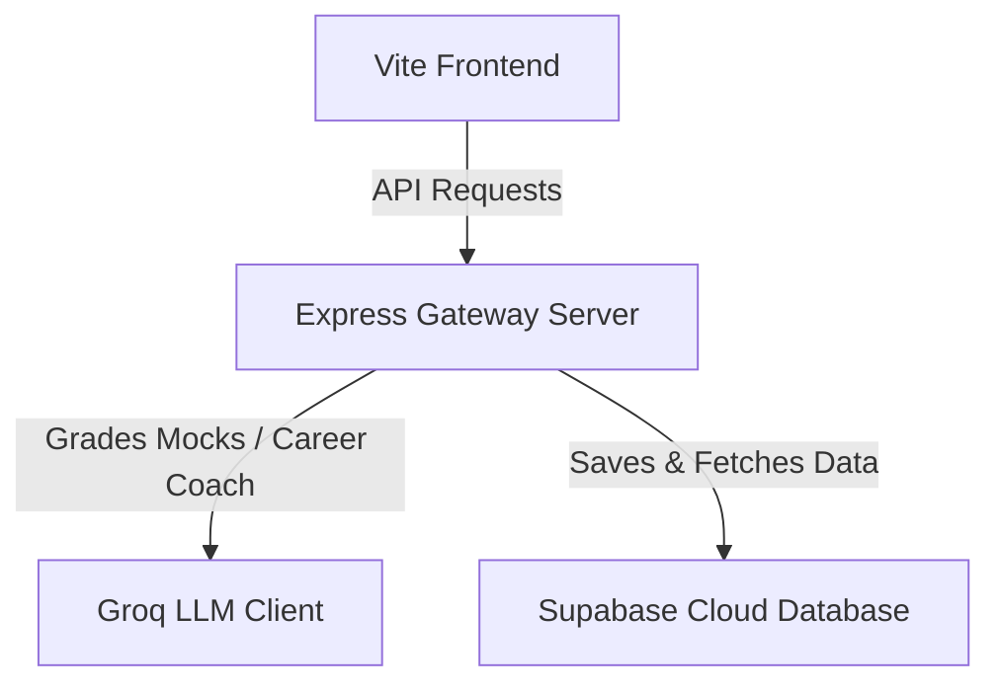

# MentorAI Deployment Guide

This guide outlines how to deploy the MentorAI full-stack application (Vite/TanStack Start frontend & Node.js Express backend) to cloud production for free.

---

## Deployment Architecture

- **Frontend**: Deployed to **Vercel** or **Netlify** (Free Static Web Hosting).
- **Backend**: Deployed to **Render** or **Railway** (Free Node.js App Hosting).
- **Database**: Hosted on **Supabase** (Free Cloud PostgreSQL).

---

## Step 1: Deploy the Database (Supabase)

1. Sign up on [Supabase](https://supabase.com) and create a free project.
2. In the left navigation, go to **SQL Editor** ➔ **New Query**.
3. Paste the table schema script located in [walkthrough.md](file:///C:/Users/sande/.gemini/antigravity-ide/brain/2d300693-a5fd-4165-a86b-efd6c97a7d9a/walkthrough.md) and click **Run**.
4. Go to **Settings ➔ API** and copy your:
   - **Project URL**
   - **`anon` public API key**
   - **`service_role` secret key**
   - **JWT Secret**

---

## Step 2: Deploy the Backend Server (Render)

1. Sign up on [Render](https://render.com) and link your GitHub repository.
2. Click **New +** ➔ **Web Service**.
3. Choose your repository. Set the following details:
   - **Root Directory**: `backend`
   - **Build Command**: `npm install`
   - **Start Command**: `npm start`
4. Expand **Advanced ➔ Environment Variables** and add:
   - `PORT=10000` (Render binds ports automatically, but setting it explicitly is a best practice)
   - `JWT_SECRET=your_custom_jwt_signing_key`
   - `GROQ_API_KEY=your_groq_api_token`
   - `SUPABASE_URL=your_supabase_project_url`
   - `SUPABASE_ANON_KEY=your_supabase_anon_public_key`
   - `SUPABASE_SERVICE_ROLE_KEY=your_supabase_service_role_secret_key`
   - `SUPABASE_JWT_SECRET=your_supabase_project_jwt_secret`
5. Click **Create Web Service**. Wait for the build to finish. Copy the generated service URL (e.g. `https://mentor-ai-api.onrender.com`).

---

## Step 3: Deploy the Frontend (Vercel)

1. Sign up on [Vercel](https://vercel.com) and import your GitHub repository.
2. Configure the project settings:
   - **Framework Preset**: `TanStack Start` (or `Other`)
   - **Root Directory**: `frontend`
   - **Build Command**: `npm run build`
   - **Output Directory**: Leave empty/default (do NOT override to `dist` or `dist/client`; Vercel automatically detects the Nitro build output at `.vercel/output`).
3. Under **Environment Variables**, add:
   - `VITE_API_URL=https://your-backend-render-url.onrender.com/api` (Use the Render URL from Step 2)
   - `VITE_SUPABASE_URL=your_supabase_project_url`
   - `VITE_SUPABASE_ANON_KEY=your_supabase_anon_public_key`
4. Click **Deploy**. Vercel will build and host your frontend application.

---

## Step 4: Verify Your Deployment

Open your Vercel deployment URL in the browser:
- Test registration, email validation, and social auth logins. They will run seamlessly via the Supabase Auth system.
- Complete a mock interview and download/export your reports. The evaluations will save instantly to your cloud database!
